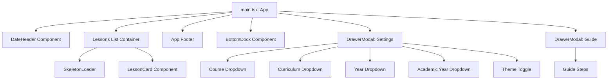
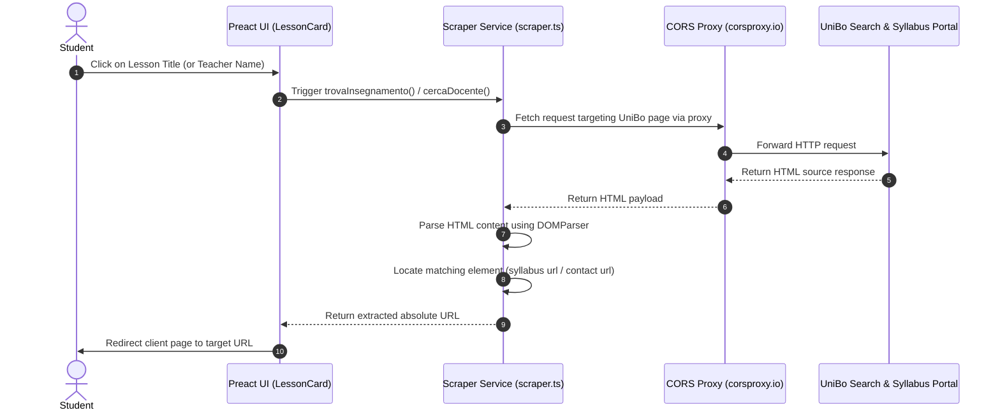
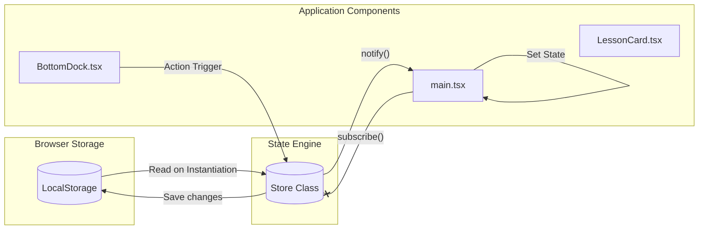

# Architectural Specification

This document provides a technical overview of the UniBo Lessons architecture. The application is built as a client-side single-page application (SPA) with no dedicated backend server. It relies on official University of Bologna (UniBo) API endpoints, CORS proxies, and client-side storage to deliver a fast, responsive, and persistent mobile-first experience.

---

## Architectural Goals

1. **Serverless Static Hosting**: The application must be compilable into flat HTML, CSS, and JS files to remain compatible with free static hosting platforms like GitHub Pages.
2. **Resilient Data Access**: Timetables must be fetched dynamically on the client. To prevent failures due to network or routing issues, the app implements fallback URL polling.
3. **Persistent Offline-First Configurations**: Selected course details, language choices, academic year overrides, and theme configurations must be stored locally on the browser so students only configure their settings once.
4. **Scraping-Based Enrichment**: Supplementary data, such as syllabus details and teacher contact pages, must be scraped and loaded dynamically through CORS proxies to keep the interface self-contained and clean.

---

## Component Tree and Layout Structure

The layout utilizes a single main canvas that coordinates modals, headers, footers, lists, and a glassmorphic bottom control dock. 

### Component Roles

- **App (`main.tsx`)**: Integrates the state from the custom Store, monitors changes, initiates schedule fetches, and manages modals (Settings, Guide).
- **DateHeader**: Displays the current calendar day and year, wrapping a standard date picker. Includes quick arrow navigation to jump backward or forward in time.
- **BottomDock**: A fixed, floating glassmorphic container at the bottom of the viewport. It contains primary controls for sliding open Settings or Guide manuals, changing dates, and toggling calendar states.
- **DrawerModal**: A bottom-sheet overlay designed to mimic native mobile system sheets. Used for deep-configuration views and help guides.
- **LessonCard**: Formats individual schedule entries, presenting timestamps, classroom halls, buildings, and teacher designations. Contains asynchronous click triggers that fetch teacher details and syllabuses.
- **SkeletonLoader**: Standardized HTML mockup bones styled with pulse keyframes to represent loading states.

---

## Data Scraping and API Flow

The application interfaces directly with external UniBo domains. Since standard browsers prohibit cross-origin requests, a public CORS proxy (`corsproxy.io`) is utilized to facilitate search scraping.

### API Retrieval Specifications

1. **Schedule API Fallbacks (`src/services/api.ts`)**:
   Timetables are queried via standard GET requests. If a course or curriculum timetable fails on the primary Italian endpoint, it retries on the English directory path.
   - Primary: `https://corsi.unibo.it/tipo/corso/orario-lezioni/@@orario_reale_json`
   - Fallback: `https://corsi.unibo.it/tipo/corso/timetable/@@orario_reale_json`
   
2. **Curriculum Resolution**:
   If a degree program contains specialized paths, the available options are fetched dynamically from `@@available_curricula` using a similar fallback routing method.

3. **Teacher Directory Search (`cercaDocente`)**:
   Queries the public employee database at:
   `https://www.unibo.it/uniboweb/unibosearch/rubrica.aspx?tab=FullTextPanel&query={name}&tipo=people`
   It searches for the primary contact card matching class `table.contact.vcard` and pulls the anchor with class `a.url`.

4. **Syllabus Module Search (`trovaInsegnamento`)**:
   Searches the syllabus catalog by passing the module code and matching the assigned professor:
   `https://www.unibo.it/it/studiare/insegnamenti-competenze-trasversali-moocs/insegnamenti?search=True&codiceMateria={code}&annoAccademico={year}`
   It scans all elements of class `.mainteaching`, verifies if the teacher name exists in the card, and extracts the syllabus detail URL.

---

## State Management and Persistence

State management is handled by a custom, lightweight reactive Store (`src/state/store.ts`). This avoids the overhead of large libraries while providing granular control over LocalStorage synchronization.

### State Store Structure

The `AppState` interface manages the following attributes:

- `course`: Unique alphanumeric ID of the active course.
- `type`: Degree tier classification (e.g., `triennale`, `magistrale`, `singlecycle`). Used for routing APIs.
- `anno`: Student year of enrollment (integer from 1 to 5).
- `curriculum`: Curricular specialization, if applicable.
- `currentDate`: The schedule target date.
- `language`: Interface setting, supporting English (`en`) and Italian (`it`).
- `theme`: Interface display style, supporting `light` and `dark`.
- `academicYearOverride`: Student-defined academic year, bypassing automatic calculation.

### State Actions

Modifications are executed through explicit methods on the global `appStore` object (e.g., `setCourse`, `setAnno`, `toggleTheme`, `toggleLanguage`). When an update occurs:
1. The internal state object is modified.
2. The revised values are committed to `localStorage`.
3. Registered callback listeners are executed, triggering state updates in components using Preact hooks.

---

## Styling Design System

Styling is organized into clear utility-first layers inside `src/styles/` to enable fluid theme adjustments.

1. **CSS Variables (`base.css`)**:
   The core configuration of typography, margins, border radiuses, and dynamic colors are maintained as CSS custom properties under `:root`.
   Theme adjustments (dark/light toggles) modify the application by appending the class `dark-mode` to the root `body` element, swapping active HSL variables:
   - Light Theme backgrounds: Warm and light grays (`#f8fafc`).
   - Dark Theme backgrounds: Deep blue-grays (`#090d16`).
   - Primary accents: Sleek borders, high-contrast text, and glowing border animations.
   
2. **Layout & Glassmorphism (`components.css`)**:
   - **Glassmorphic Navigation**: The floating bottom dock and modals use `backdrop-filter: blur(20px)` and semi-transparent background colors combined with fine borders.
   - **Responsive Scaling**: Mobile viewport adaptation utilizes custom padding properties, avoiding horizontal scrollbars and fitting nicely on both phone sizes and web browsers.
   - **Animations**: CSS animations include keyframe pulses for skeleton bones and slide-up drawers for a premium native look.
